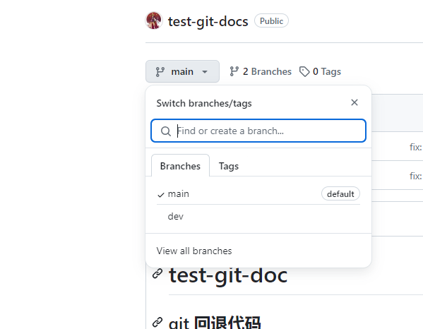
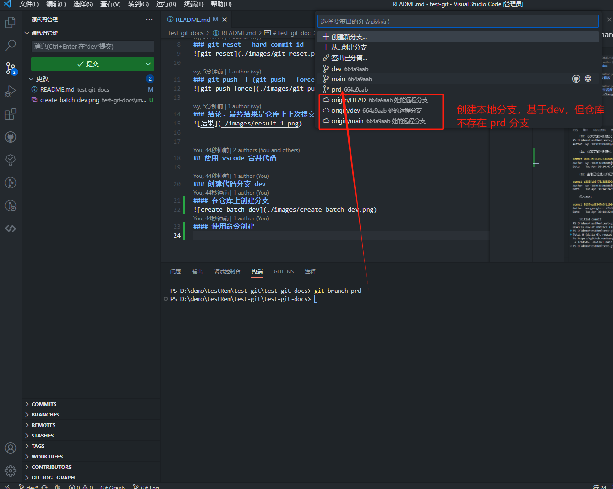

# test-git-doc

## git 回退代码

### git log  查看所有提交记录

### git reset --hard commit_id

### git push -f (git push --force) 强制提交

### 结论：最终结果是仓库上上次提交的 commit 信息也会被删除

## 使用 vscode 合并代码

### 创建代码分支 dev
#### 在仓库上创建分支

#### 使用命令创建

#### 切换到 prd 分支

#### 推送 prd 分支到 远程仓库

