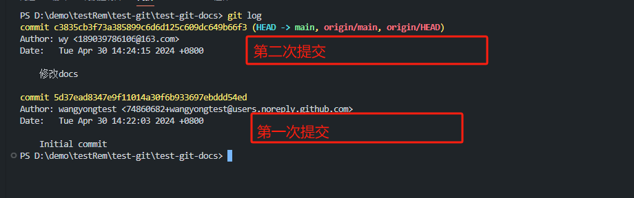
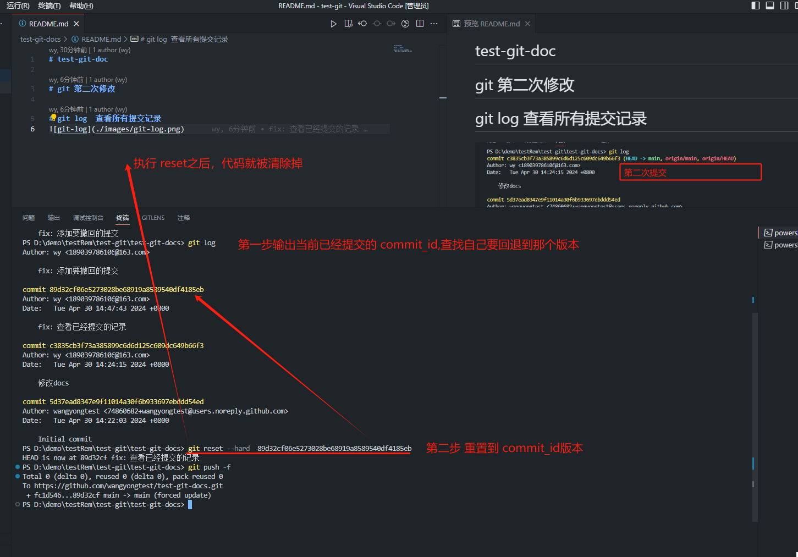
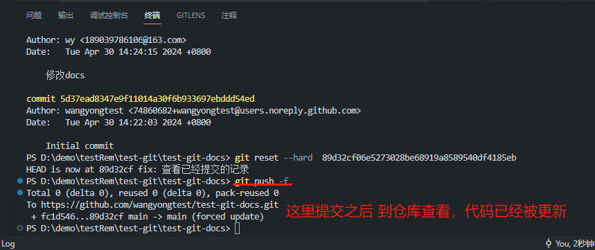
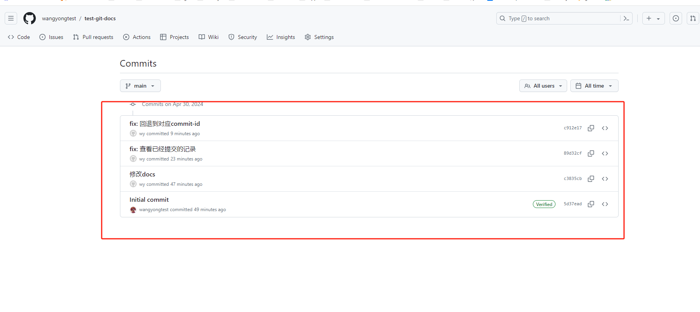
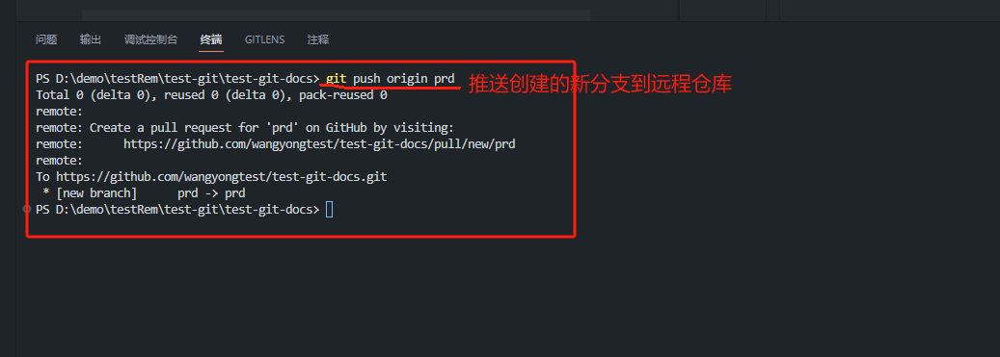
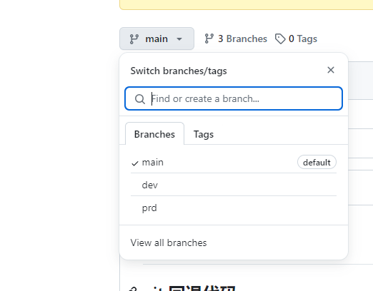
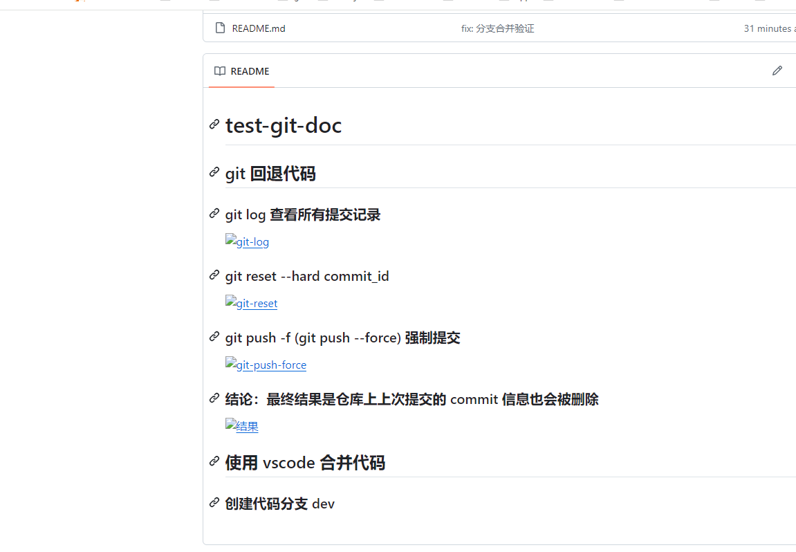
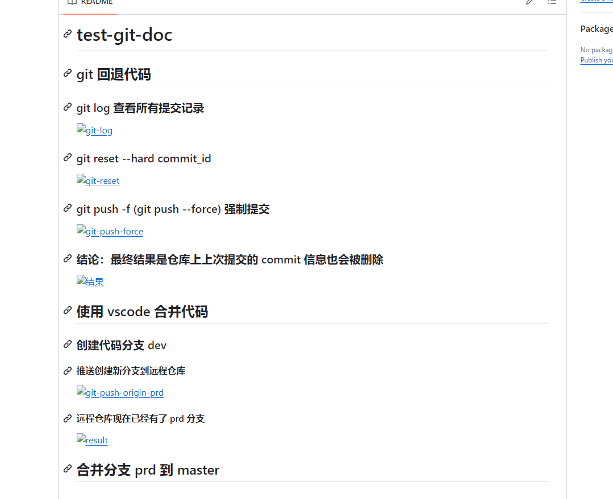
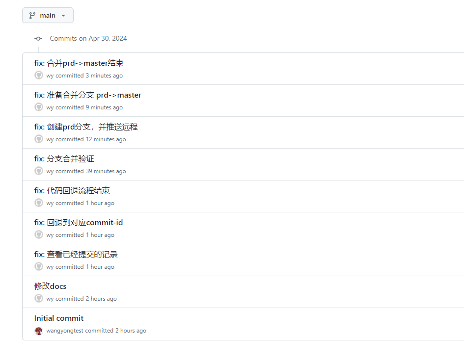

# test-git-doc

## git 回退代码

### git log  查看所有提交记录

### git reset --hard commit_id

### git push -f (git push --force) 强制提交

### 结论：最终结果是仓库上上次提交的 commit 信息也会被删除

## 使用 vscode 合并代码

### 创建代码分支 dev

#### 推送创建新分支到远程仓库

#### 远程仓库现在已经有了 prd 分支

## 合并分支 prd 到 master
### 合并分支要注意：当前所在分支为目标分支(也就是master)

### 总结：合并代码一定要切换到要合并的分支（目标分支：也就是最重要合并到的分支。例如：prd->master：一定要切换到 master ,执行 git merge prd， 是否有冲突，解决完冲突后，push到远程）
